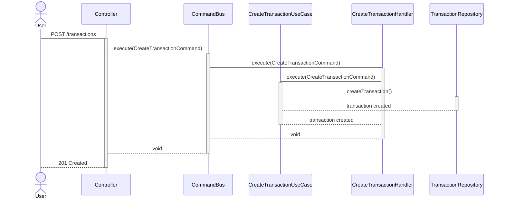
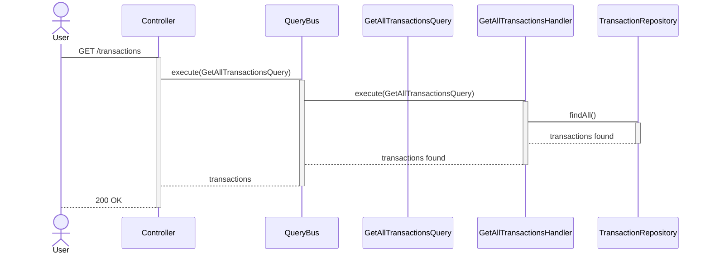
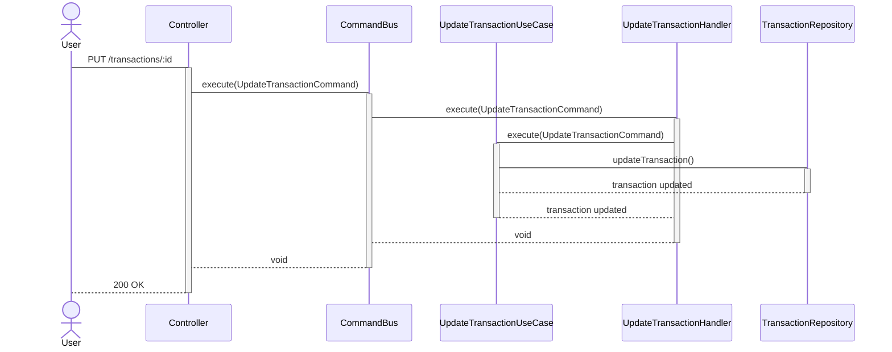
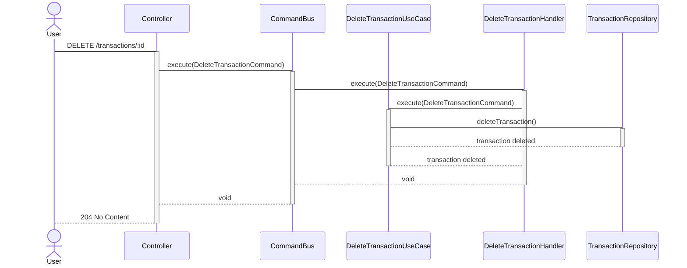
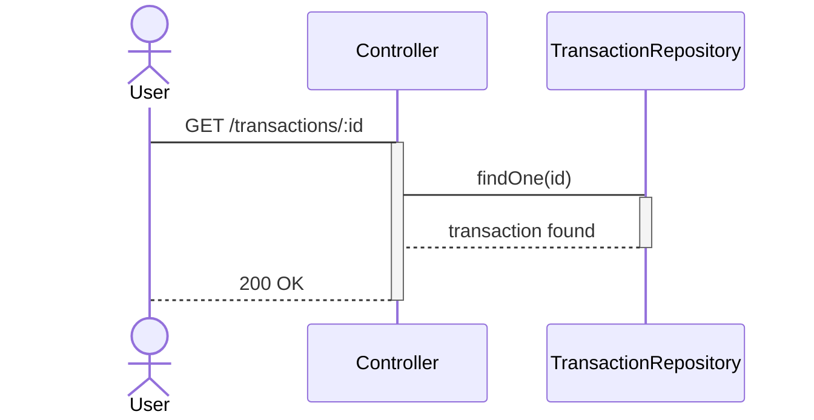

# API Buicorporation

## Description

Ceci est une API simple pour gérer les transactions en utilisant NestJS, Postgres, et Docker.

## Installation

1. Clonez le dépôt :
   ```sh
   git clone https://github.com/el-hack/technical-test.git
   cd technical-test
   ```


2. Se mettre sur la branch de l'API :
   ```sh
   git switch el-hack-api
   ```


2. Copier le contenue de .env.exemple pour le mettre dans un fichier .en :
   ```sh
   git switch el-hack-api
   ```


3. Exécutez l'application à l'aide de Docker :
   ```sh
   docker-compose up --build
   ```

4. L'API sera disponible sur http://localhost:3333.


#### 5. Documentation

- Créer des diagrammes de séquence pour décrire le flux de l'application, notamment pour l'implémentation du CQRS.
- Document your code as you go, explaining the purpose of each module, controller, and service.

### Example Sequence Diagram



## Diagramme de Séquence pour la Récupération de Toutes les Transactions



## Diagramme de Séquence pour la Mise à Jour d'une Transaction



## Diagramme de Séquence pour la Suppression d'une Transaction



## Diagramme de Séquence pour la Recherche d'une Transaction par ID




## Exemple d'Utilisation

Voici comment vous pouvez utiliser chaque cas d'utilisation dans notre application :


### Créer une Transaction

Pour créer une nouvelle transaction, vous pouvez envoyer une requête POST à l'endpoint /transactions avec les détails de la transaction dans le corps de la requête.

Exemple de requête HTTP :

   ```sh
   POST /transactions
   Content-Type: application/json

   {
   "amount": 100.00,
   "description": "Achat en ligne",
   "date": "2024-05-27"
   }
   ```